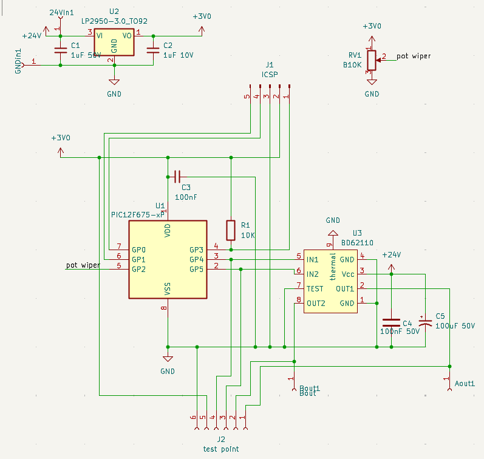
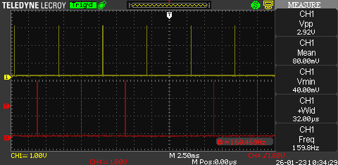
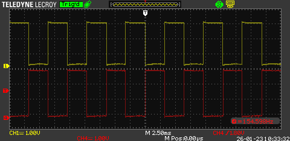
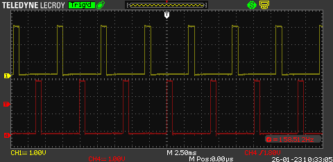
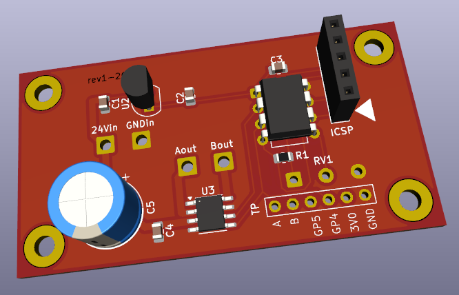

# 2 wire LED string power supply & dimmer
logic control for an H-bridge based PSU. Esssentially 2 complementary PWM signals that never go above 50% duty cycle. Intended to drive &amp; PWM dim a string of festive LED's

Using a PIC12F675 and a BD62110 Motor Driver IC to create a  +/-24V PWM signal. Software PWM operates on a ~150Hz period.

A string of 150 Christmas fairy lights (pulling unknown current) on 2 wires, supplied with a CZJUTAI power supply (model JT-EL/FC249"-G4). The PSU output is rated between 24 & 26V, 9W (so somewhere in the region of 360mA rated output). The power supply has a number of flashing modes/patterns and a auto-off timer (6 hours on 18 off?). The steady-on mode works fine, but the lights are too bright of an evening. I do not want any of the flashing modes, but I would like to be able to dim the lights.

The power supply seems to contain an H-bridge which takes 25V DC and outputs 50V peak to peak sqaure wave at about 242Hz. It may be possible to deconstruct the PSU & replace the microcontroller, but I thought it neater to start from scratch. PIC12F675 is an 8pin 4MHz MCU, operating at 1us per instruction. The BD62110 is an H-bridge with some additional features like MOSFET driver circuit & crossover protection, it will handle from 8V to 28V input and drive up to 1Amp continuous current.

On the PIC, two output pins will drive the BD62110, one ADC input pin will read the potentiometer voltage to change the PWM duty cycle. On the BD62110 we will feed in 24V DC and the input logic. The LED string has its own current limiting circuitry, so the output will go directly to the LED string.

Because we are driving 2 complementary PWM signals the PWM frequency is effectively halved - each singal is on for at most 50% of the time (fractionally below 50% to avoid shoot-through). So I actually need to achieve a ~300Hz PWM. Optimising the code is crucial to achieving the smallest PWM step. Initially at 32us, improvements can be made to reduce this to 25us. Initially I used a 128 entry lookup table for gamma correction, then read the lowest 8 bits of the ADC and shifted that by 1 bit to get a 7 bit (128 values) reading. By using a larger lookup table with 256 entries I use more program space, but don't need to do the left shift operation, saving a few us on each interation. Using 256 PWM steps would mean that I would not need to wrap the counter (as it would overflow), but 128 steps allows for a much faster operation.

Further optimisations include using single comparison operators (> rather than >=). For example, testing `if(a == 1)` if`(a>1)` `if(a>=1)` yields differences, or approaches like: `if(a==6)` vs `if(7>a && a>5)`

at minimum duty cycle the on period for each LED is 32us;

at 100% the duty cycle is in reality 50% on, 50% off;

and at some intermediate duty cycle;

These examples are using a 7bit ADC mapped to 100 levels of brightness, so each duty cycle consists of 
(32us × 100 possibly high according to duty cycle) + (32us × 100 definitely low) ≈ 164Hz

easily fits a 66 × 32 mm board

